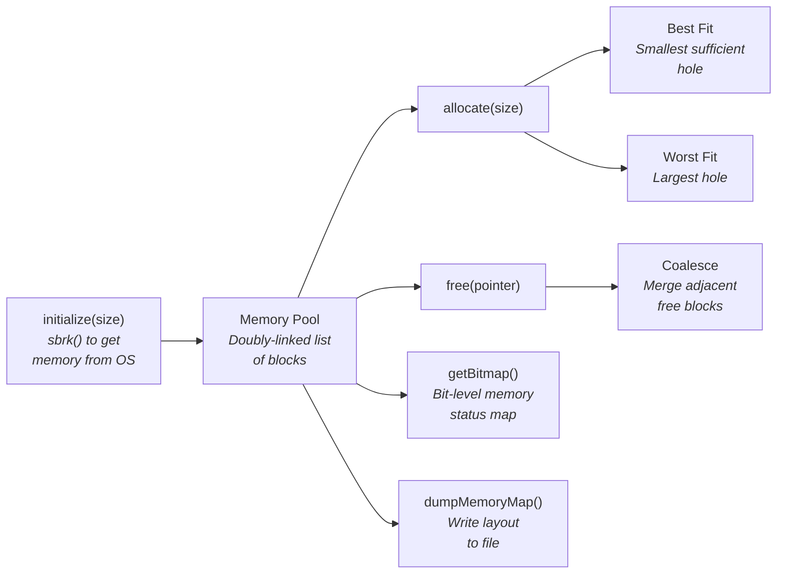

# MemoryManager — Custom Memory Allocator in C++

A low-level memory allocator built from scratch using `sbrk()` system calls, a doubly-linked list of memory blocks, and configurable allocation strategies (best-fit and worst-fit). Includes hole coalescing, bitmap memory visualization, and Valgrind-verified leak-free operation.


## What This Is

A userspace memory manager that replaces `malloc`/`free` with custom allocation logic. It manages a contiguous block of memory obtained via `sbrk()`, tracks allocated and free blocks using a doubly-linked list, and implements two allocation strategies for studying memory fragmentation behavior.

## How It Works



## Technical Highlights

- **sbrk() Memory Acquisition** — Requests raw memory from the OS using the `sbrk()` system call, managing it entirely in userspace with no reliance on the standard allocator.
- **Best-Fit / Worst-Fit Strategies** — Two configurable allocation algorithms. Best-fit minimizes wasted space per allocation; worst-fit reduces fragmentation by keeping large holes available.
- **Hole Coalescing** — When a block is freed, the allocator checks adjacent blocks and merges contiguous free blocks to prevent fragmentation buildup.
- **Memory Alignment** — Handles proper alignment requirements so allocated blocks respect CPU word boundaries.
- **Bitmap Visualization** — `getBitmap()` returns a bit-level representation of memory status (allocated vs. free), useful for debugging and understanding fragmentation patterns.
- **Memory Map Dump** — `dumpMemoryMap()` writes the complete block list (addresses, sizes, status) to a file for analysis.
- **Valgrind Verified** — Tested with Valgrind to confirm zero memory leaks and no invalid memory access.

## Core API

```cpp
void  initialize(unsigned int size, bool bestFit);  // Get memory from OS
void* allocate(unsigned int size);                   // Allocate a block
void  free(void* pointer);                           // Free a block (+ coalesce)
vector<bool> getBitmap();                            // Bit-level memory status
vector<pair<void*, unsigned int>> getList();          // List of free holes
void  dumpMemoryMap(string filename);                // Write layout to file
```

## Building & Running

```bash
make              # Build with g++
./memmanager      # Run
make valgrind     # Run with Valgrind leak checking
```

## What I Learned

Building a memory allocator from scratch gives you an appreciation for what `malloc` does behind the scenes — and why fragmentation, alignment, and coalescing matter in systems programming. It's one of the best exercises for understanding how operating systems manage the resource that every program depends on.
